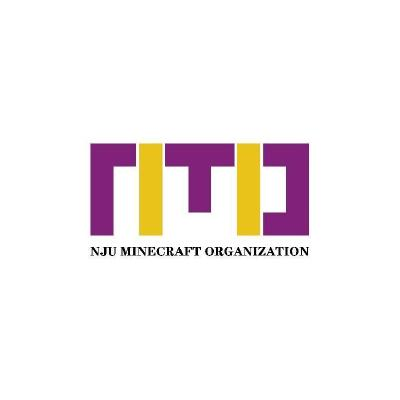

# ⛏️ NJU Minecraft Organization ⚔️

**南京大学 Minecraft 协会** · 方块与创造，在校园里相聚 🧱✨

 

---

## 🏫 [关于我们](https://www.nmo.net.cn/)

在 Minecraft 基础上，发展建筑，计算机，软件，电路，建模等方面的知识水平，充分利用同学们的兴趣，形成具有南大特色的 mc 社区文化，进一步提升学校影响力。

## 📋 [工作一览](https://github.com/orgs/nju-mc-org/projects/4)

协会议题、活动安排与项目进度，统一在[看板](https://github.com/orgs/nju-mc-org/projects/4)中跟进。欢迎在网站上获取最新公告。

## 💻 开放代码仓

### 🌐 官方网站

| 项目 | 说明 |
| :-- | :-- |
| [**neco**](https://github.com/nju-mc-org/neco) | 网页前端 |
| [**necore**](https://github.com/nju-mc-org/necore) | 网页后端 |

### 🛠️ 其他

更多社区工具与活动仓库会持续补充；若你有想法或想参与贡献，可从对应仓库的 Issue 与说明入手。

---

**🗺️ 方块无界，校园有缘** — [nmo.net.cn](https://www.nmo.net.cn/) · GitHub · [@nju-mc-org](https://github.com/nju-mc-org)

